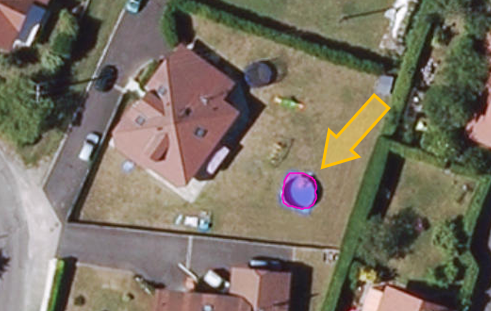
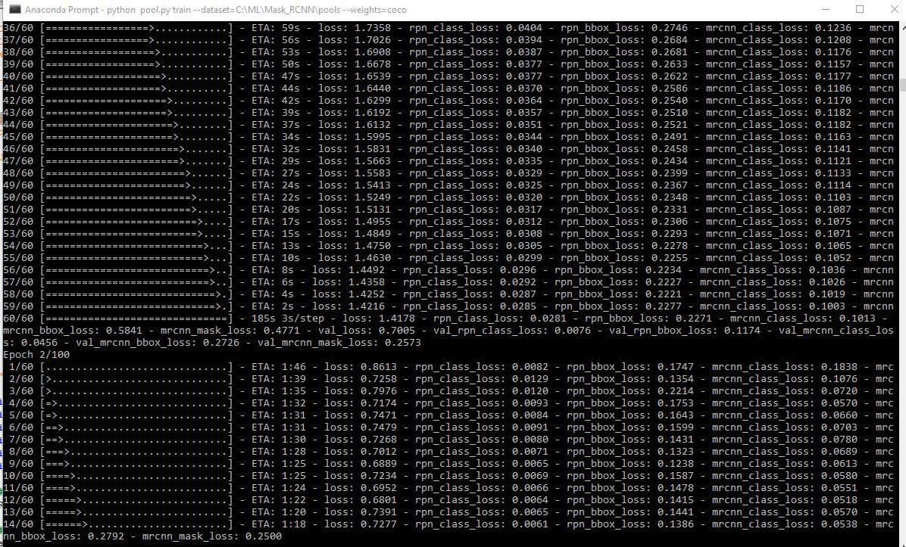

# Techda 2018 : "Pop-up" pool detection using ArcGIS, Machine Learning and Deep Learning

This repository is part of the Esri Suisse [Techday 2018](https://www.techday.ch/) workshop **"Digitale Explosion und «The Science of Where»"**


# Useful links

The general implementation have been made based on this specific open source project :
https://github.com/matterport/Mask_RCNN

>This is an implementation of [Mask R-CNN](https://arxiv.org/abs/1703.06870) on Python 3, Keras, and TensorFlow. The model generates bounding boxes and segmentation masks for each instance of an object in the image. It's based on Feature Pyramid Network (FPN) and a ResNet101 backbone.
> 

In order to implement our own pool detection we followed this great tutorial  that aims to find balloons in images. The global idea was to replace "balloons" with "pools" and it worked quite well :
https://github.com/matterport/Mask_RCNN/tree/master/samples/balloon

>This is an example showing the use of Mask RCNN in a real application.
We train the model to detect balloons only, and then we use the generated 
masks to keep balloons in color while changing the rest of the image to
grayscale.
>[This blog post](https://engineering.matterport.com/splash-of-color-instance-segmentation-with-mask-r-cnn-and-tensorflow-7c761e238b46) describes this sample in more detail.


>


# Setup

The implementation and training has been done on a Windows 10 computer with the use of a personal Nvidia 1070 GPU for the training part.

It could have been done on any GPU powered cloud instance, could it be Azure, AWS or more "niche" players specialized in deep learning like [Crestle](https://www.crestle.com/) or [Paperspace](https://www.paperspace.com/)

The GPU is not needed for the detection using a trained model : you can do that on your CPU (it's slower but enough to check the result)

We found the setup steps for a Mask RCNN repo here :
https://github.com/markjay4k/Mask-RCNN-series/blob/master/Mask_RCNN%20Install%20Instructions.ipynb

## Overview on how to install base Mask RCNN

* Step 1: create a conda virtual environment with python 3.6
* Step 2: install the dependencies
* Step 3: Clone the Mask_RCNN repo
* Step 4: install pycocotools


## Specific for the pool detection

* Step 5: download the pre-trained weights
* Step 6: Test it


### Step 1 - Create a conda virtual environment
we will be using Anaconda with python 3.6.

If you don't have Anaconda, follow this tutorial

https://www.youtube.com/watch?v=T8wK5loXkXg

run this command in a CMD window
> conda create -n MaskRCNN python=3.6 pip

### Step 2 - Install the Dependencies
place the requirements.txt in your cwdir
https://github.com/markjay4k/Mask-RCNN-series/blob/master/requirements.txt
run these commands

```
activate MaskRCN 
pip install -r requirements.txt
```

NOTE: we're installing these (tf-gpu requires some pre-reqs) : 
numpy, scipy, cython, h5py, Pillow, scikit-image, 
tensorflow-gpu==1.5, keras, jupyter

### Step 3 - Clone the Mask RCNN Repo
Run this command
```
git clone https://github.com/matterport/Mask_RCNN.git
```

### Step 4 - Install pycocotools
NOTE: pycocotools requires Visual C++ 2015 Build Tools
download here if needed https://www.visualstudio.com/downloads/#build-tools-for-visual-studio-2017

```
pip install git+https://github.com/philferriere/cocoapi.git#subdirectory=PythonAPI
```

### Step 5 - Download the Pre-trained Weights

File (mask_rcnn_poolall.h5 , 250 Mb) for pool detection can be found here

https://drive.google.com/file/d/1wZbFQKipZFdiukwjg5GgEazlzC1CSVBu/view?usp=sharing


### Step 6 - Let's Test it!
open up the Techday 2018.ipynb and run it

# Train your own

Using labeled data and images, we trained our own model by launching the following command

```
python3 pool.py train --dataset=C:\ML\Mask_RCNN\pools --weights=coco
```

